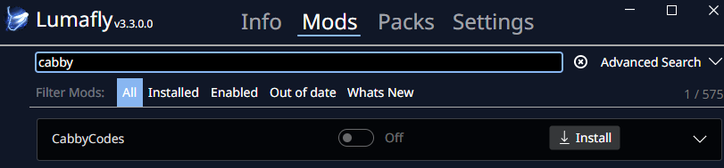

# CabbyCodes - Hollow Knight Cheat Menu Mod

A comprehensive cheat menu mod for Hollow Knight that provides extensive control over player stats, inventory, and game state through an intuitive in-game interface.

## 📋 Table of Contents
- [What is CabbyCodes?](#-what-is-cabbycodes)
- [Installation](#-installation)
  - [Lumafly Installation (Recommended)](#option-a-lumafly-installation-recommended)
  - [BepInEx 6 Installation](#option-b-bepinex-6-installation)
  - [BepInEx 5 Installation](#option-c-bepinex-5-installation)
- [Usage](#-usage)
- [Configuration](#-configuration)
- [User Troubleshooting](#-user-troubleshooting)
- [Development](#-development)
- [Contributing](#-contributing)
- [License & Third-Party Licenses](#-license)
- [Support](#-support)

## 🎮 What is CabbyCodes?

CabbyCodes is a powerful cheat menu mod that gives you complete control over your Hollow Knight experience. Whether you want to experiment with different builds, test game mechanics, or simply have fun with unlimited resources, CabbyCodes provides an easy-to-use interface accessible directly from the pause menu.

### Key Features

#### 🛡️ Player Modifications
- **Invulnerability**: Toggle player invincibility
- **Geo Management**: Set geo amount (0-9,999,999)
- **Infinite Soul**: Modify soul reserves and focus
- **Damage Control**: Toggle one-hit kills for enemies
- **Movement**: Infinite Air Jump

#### 📦 Inventory Management
- **Currency Items**: 
  - Wanderer's Journals (0-14)
  - Hallownest Seals (0-17)
  - King's Idols (0-8)
  - Arcane Eggs (0-4)
  - Rancid Eggs (0-80)
  - Pale Ore (0-6)
- **Keys**: All game keys and access items
- **Spells**: Control spell levels and upgrades
- **Nail Arts**: Manage nail art abilities
- **Charms**: Complete charm management system

#### 🎯 Game State Control
- **Hunter's Journal**: Complete enemy kill tracking
- **Grub Rescue**: Control grub collection status (46 total grubs)
- **Map Control**: Manage map exploration and pins
- **Achievements**: Achievement tracking and control
- **Flags**: Various game state flags and triggers

#### 🚀 Teleportation
- **Custom Locations**: Add and manage custom teleport points
- **Quick Travel**: Instant travel to any discovered location

#### 💾 Custom Save System
- **Unlimited Save Files**: Create unlimited custom save files at any point in the game
- **Location-Based Saves**: Save at specific points of interest and any location
- **Quick Load**: Instantly load any custom save file from the in-game menu
- **Save Management**: Organize and manage multiple save files with custom names
- **Real Saves**: These save files encoded like normal saves!  You can replace your slot save with one of these!

## 🖼️ Visual Showcase

See CabbyCodes in action! Here are screenshots of the various menu sections and features:


*The Cabby Codes button seamlessly integrates into the game's pause menu*


*The main cheat menu with organized categories and useful player cheats*


*Access anything inventory related*


*Custom teleport locations and quick travel system*


*Complete charm system with costs and effects management*


*Track and control all 46 grub rescue locations*


*Complete enemy kill tracking and journal management*


*Control boss encounters and game progression flags*


*Track and manage all game achievements*


*Create unlimited custom save files at any location*

## 🚀 Installation

CabbyCodes supports three mod loaders: **Lumafly** (Hollow Knight Modding API), **BepInEx 6**, and **BepInEx 5**. Lumafly is the recommended option for most users as it's the standard mod manager for the Hollow Knight modding community.

### Option A: Lumafly Installation (Recommended)

Lumafly is the official mod manager for Hollow Knight and provides the easiest installation experience. CabbyCodes is now available directly in the Lumafly mod browser!

#### Installation Steps

1. **Install Lumafly** (if you haven't already):
   - Download and run [Lumafly](https://github.com/TheMulhima/Lumafly/releases)

2. **Install CabbyCodes**:
   - Open Lumafly
   - Search for "CabbyCodes" in the mod browser
   - Click the **Install** button


*Search for "cabby" in Lumafly and click Install to add CabbyCodes*

3. **Launch the Game**:
   - Start Hollow Knight through Lumafly or Steam
   - Pause the game to access the cheat menu

#### Important Notes for Lumafly Users
- Lumafly handles all dependencies automatically
- Updates are managed through Lumafly - check for updates regularly
- Check `%APPDATA%\..\LocalLow\Team Cherry\Hollow Knight\ModLog.txt` for any loading errors

---

#### Manual Lumafly Installation (Alternative)

If you prefer to install manually or need to install a specific version, follow these steps:

##### Prerequisites
- Hollow Knight (Steam version)
- [Lumafly](https://github.com/TheMulhima/Lumafly) mod manager with Modding API installed

##### Installation Steps
1. **Install Lumafly**:
   - Download and run [Lumafly](https://github.com/TheMulhima/Lumafly/releases)
   - Install any mod through Lumafly to set up the Modding API

2. **Install CabbyCodes**:
   - Download the latest release from the [releases page](https://github.com/SirCabby/HKCabbyCodes/releases)
   - Extract the `CabbyCodes for Lumafly/` folder
   - Copy the **entire folder contents** to a new folder:
     - `Hollow Knight/hollow_knight_Data/Managed/Mods/CabbyCodes/`
   - The folder should contain:
     - `CabbyCodes.dll`
     - `CabbyMenu.dll`

3. **Verify Installation**:
   - Start the game - the mod should appear in Lumafly's mod list
   - Pause the game to access the cheat menu

##### Important Notes for Manual Installation
- HKAPI mods go in `Managed/Mods/` not `BepInEx/plugins/`
- Each mod needs its own subfolder within the `Mods` directory

---

### Option B: BepInEx 6 Installation

For users who prefer BepInEx 6 or have an existing BepInEx 6 setup.

#### Prerequisites
- Hollow Knight (Steam version)
- BepInEx 6.x

#### Installation Steps
1. **Install BepInEx 6**:
   - Download BepInEx 6 from [GitHub](https://github.com/BepInEx/BepInEx/releases)
     - Download `BepInEx-Unity.Mono-win-x64-6.0.0-pre.2.zip`
   - Extract to your Hollow Knight directory:
     - `C:\Program Files (x86)\Steam\steamapps\common\Hollow Knight`
   - Run the game once to generate BepInEx folders

2. **Install CabbyCodes**:
   - Download the latest release from the releases page
   - Extract the `CabbyCodes for BepInEx 6/` folder
   - Copy both `CabbyCodes.dll` and `CabbyMenu.dll` to `Hollow Knight/BepInEx/plugins/`

3. **Verify Installation**:
   - Start the game and pause to access the cheat menu

---

### Option C: BepInEx 5 Installation

For users with an existing BepInEx 5 setup or compatibility requirements.

#### Prerequisites
- Hollow Knight (Steam version)
- BepInEx 5.x

#### Installation Steps
1. **Install BepInEx 5**:
   - Download BepInEx 5 from [GitHub](https://github.com/BepInEx/BepInEx/releases/tag/v5.4.23.2)
     - Download `BepInEx_win_x64_5.4.23.2.zip`
   - Extract to your Hollow Knight directory:
     - `C:\Program Files (x86)\Steam\steamapps\common\Hollow Knight`
   - Run the game once to generate BepInEx folders

2. **Install CabbyCodes**:
   - Download the latest release from the releases page
   - Extract the `CabbyCodes for BepInEx 5/` folder
   - Copy both `CabbyCodes.dll` and `CabbyMenu.dll` to `Hollow Knight/BepInEx/plugins/`

3. **Verify Installation**:
   - Start the game and pause to access the cheat menu

## 🎯 Usage

### Accessing the Menu
1. **Pause the game** (ESC key)
2. **Click the "Cabby Codes" button** that appears
3. **Navigate categories** using the dropdown menu
4. **Modify values** by clicking on input fields

### Menu Categories
- **Player**: Health, geo, soul, abilities
- **Inventory**: All collectible items and currency
- **Charms**: Charm management and costs
- **Maps**: Map exploration and pins
- **Grubs**: Grub rescue tracking
- **Hunter**: Enemy kill tracking
- **Flags**: Game state flags
- **Achievements**: Achievement control
- **Debug**: Debug utilities and information

## ⚙️ Configuration

### Config File Location

The config file location depends on your mod loader:

**BepInEx:**
```
Hollow Knight/BepInEx/config/cabby.cabbycodes.cfg
```

**Lumafly/HKAPI:**
```
Hollow Knight/hollow_knight_Data/Managed/Mods/CabbyCodes/CabbyCodes.cfg
```

### Configuration System
The mod uses a configuration system for:
- **Teleport Locations**: Custom teleport points are automatically saved and loaded
- **Game State**: Various game modifications are persisted between sessions
- **Menu Settings**: Basic menu configuration options

### Teleport System
Custom teleport locations are automatically saved to the config file and will persist between game sessions. The system maintains:
- Location coordinates (X, Y)
- Scene names
- Display names for easy identification

## 🐛 User Troubleshooting

### Common Issues

**Menu doesn't appear (Lumafly/HKAPI):**
- Ensure both files (`CabbyCodes.dll`, `CabbyMenu.dll`) are in `Managed/Mods/CabbyCodes/`
- The mod must be in its own subfolder - files directly in `Mods/` won't load
- Check `ModLog.txt` at `%APPDATA%\..\LocalLow\Team Cherry\Hollow Knight\ModLog.txt` for errors
- Verify the Modding API is installed (install any mod through Lumafly first)

**Menu doesn't appear (BepInEx):**
- Ensure both `CabbyCodes.dll` and `CabbyMenu.dll` are in the `BepInEx/plugins/` folder
- Check BepInEx console for error messages
- Verify BepInEx is properly installed

**Values not updating:**
- Check that input values are within the required range

## 🛠️ Development

### Project Structure

This project uses a **multi-project solution** with three main components:

- **CabbyCodes**: Main mod plugin with game patches and logic
- **CabbyMenu**: Reusable UI library for creating mod menus
- **AssemblyTools**: Tools for analyzing Hollow Knight assemblies and references

```
HKCabbyCodes/
├── AssemblyTools/                # Tools for analyzing game assemblies
│   ├── Inspector/                # C# and PowerShell tools for analysis
│   └── Reference/                # Reference files (scenes, quick refs, docs)
│
├── CabbyCodes/                   # Main mod project
│   ├── Patches/                  # Game modification patches, organized by category
│   │   ├── Achievements/
│   │   ├── BasePatches/
│   │   ├── CharmPatch.cs
│   │   ├── Flags/
│   │   ├── GrubPatch.cs
│   │   ├── HunterPatch.cs
│   │   ├── InventoryPatch.cs
│   │   ├── Maps/
│   │   ├── Player/
│   │   ├── Settings/
│   │   ├── SpriteViewer/
│   │   └── Teleport/
│   ├── CheatState/               # Cheat state management system
│   ├── Flags/                    # Flag definitions and management
│   ├── Lumafly/                  # Lumafly-specific implementations
│   ├── SavedGames/               # Save game management
│   ├── Scenes/                   # Scene and area data
│   ├── lib/                      # BepInEx build dependencies (not in version control)
│   ├── lib-lumafly/              # Lumafly build dependencies (not in version control)
│   ├── Constants.cs              # Game-specific constants
│   ├── CabbyCodesPlugin.cs       # Main plugin entry point
│   ├── GameStateProvider.cs      # Game state logic for menu visibility
│   └── ... (other core files)
│
├── CabbyMenu/                    # UI library project
│   ├── UI/
│   │   ├── CheatPanels/          # Modular cheat panel components
│   │   ├── Controls/             # UI controls (ToggleButton, InputField, etc.)
│   │   ├── DynamicPanels/        # Dynamic panel management
│   │   ├── Modders/              # UI modder utilities
│   │   ├── Popups/               # Popup dialogs
│   │   ├── CabbyMainMenu.cs      # Main menu system
│   │   ├── Fitter.cs             # UI layout utility
│   │   └── IPersistentPopup.cs   # Popup interface
│   ├── SyncedReferences/         # Data synchronization types/interfaces
│   ├── TextProcessors/           # Input text processing utilities
│   ├── Utilities/                # Shared utilities
│   ├── Constants.cs              # UI-specific constants
│   ├── IGameStateProvider.cs     # Interface for menu visibility logic
│   └── ... (other core files)
│
├── Makefile                      # Build and deployment scripts
├── global.json                   # .NET SDK version specification (9.0.301)
├── CabbyCodes.sln                # Solution file
└── README.md                     # Project documentation
```

### 🔧 Development Requirements

#### .NET Framework and SDK
- **Target Framework**: .NET Framework 4.7.2 (required for compatibility with NuGet dependencies and BepInEx)
- **SDK Version**: .NET 9.0.301 (latest available, .NET 5.0+ is compatible)
- **Language Version**: C# 7.3 (latest supported by .NET Framework 4.7.2)

#### Required Tools
- **Visual Studio 2019/2022** or **Visual Studio Code** with C# extension
- **.NET 9.0 SDK** (for building with latest tooling)
- **Git** for version control

#### Configuration Files
- **global.json**: Specifies SDK version 9.0.301
- **CabbyCodes.csproj**: Targets `net472` with `LangVersion` set to `7.3`
- **CabbyMenu.csproj**: Targets `net472` with `LangVersion` set to `7.3`

### 📚 Dependency Management

CabbyCodes supports three build configurations with different dependency sources:

#### Build Configurations

| Configuration | Mod Loader | NuGet Packages | Local Dependencies |
|--------------|------------|----------------|-------------------|
| `BepInEx5` | BepInEx 5.x | BepInEx.Core 5.x, MonoMod.RuntimeDetour 22.01.29.01 | `lib/Assembly-CSharp.dll` (vanilla) |
| `BepInEx6` | BepInEx 6.x | BepInEx.Unity.Mono 6.0.0-be.*, MonoMod.RuntimeDetour 22.05.01.01 | `lib/Assembly-CSharp.dll` (vanilla) |
| `Lumafly` | HKAPI | UnityEngine.Modules only | `lib-lumafly/Assembly-CSharp.dll` (HKAPI-patched), MonoMod DLLs |

#### NuGet Package Sources

The project uses multiple NuGet sources configured in the `.csproj` files:
- `https://api.nuget.org/v3/index.json` - Official NuGet
- `https://nuget.bepinex.dev/v3/index.json` - BepInEx packages
- `https://nuget.samboy.dev/v3/index.json` - Additional mod dependencies

#### Local Dependencies

**For BepInEx builds** (`lib/` folder):
- `Assembly-CSharp.dll` - Vanilla (unmodified) game assembly
- `PlayMaker.dll` - PlayMaker FSM library
- `UnityExplorer.STANDALONE.Mono.dll` - Optional debug tool

**For Lumafly builds** (`lib-lumafly/` folder):
- `Assembly-CSharp.dll` - HKAPI-patched game assembly
- `MonoMod.RuntimeDetour.dll` - Runtime hooking library
- `MonoMod.Utils.dll` - MonoMod utilities

See the README files in each `lib` folder for detailed instructions on obtaining these files.

#### Hooking Strategy

All builds use **MonoMod.RuntimeDetour.Hook** for method patching:
- BepInEx builds get MonoMod via NuGet packages
- Lumafly builds use local MonoMod DLLs from the HKAPI installation
- This unified approach allows identical patch code across all platforms

### 🛠️ Building from Source

#### Using Make (Recommended)

```bash
# Build for BepInEx 6 (default)
make build

# Build for specific versions
make build VERSION=5     # BepInEx 5
make build VERSION=6     # BepInEx 6

# Build specific configurations
make build-bepinex5      # BepInEx 5 only
make build-bepinex6      # BepInEx 6 only
make build-lumafly       # Lumafly only

# Build all versions
make build-all-versions

# Clean build artifacts
make clean

# Deploy to game directory
make deploy              # BepInEx 6 (default)
make deploy VERSION=5    # BepInEx 5
make deploy-lumafly      # Lumafly
```

#### Using .NET CLI
```bash
# Restore dependencies
dotnet restore

# Build specific configurations
dotnet build CabbyCodes/CabbyCodes.csproj --configuration BepInEx5
dotnet build CabbyCodes/CabbyCodes.csproj --configuration BepInEx6
dotnet build CabbyCodes/CabbyCodes.csproj --configuration Lumafly
```

### 🔗 Project Dependencies
- **CabbyCodes** depends on **CabbyMenu** for UI functionality
- **CabbyMenu** is a standalone library that can be used by other mods
- Both projects target .NET Framework 4.7.2

### 📦 Build Output

Build outputs are organized by configuration:
- **BepInEx 5**: `CabbyCodes/bin/BepInEx5/net472/`
- **BepInEx 6**: `CabbyCodes/bin/BepInEx6/net472/`
- **Lumafly**: `CabbyCodes/bin/Lumafly/net472/`

Each contains:
- **CabbyCodes.dll**: Main mod plugin (contains game patches)
- **CabbyMenu.dll**: UI library (required by CabbyCodes)

### 🔧 Key Components

#### CabbyCodes Project
- **CabbyCodesPlugin**: Main plugin entry point
- **Patches/**: Game modification patches organized by category
- **Lumafly/**: Standalone implementations for Lumafly builds (config system, logging)
- **Constants.cs**: Game-specific constants (health limits, currency limits, etc.)

#### CabbyMenu Project
- **UI/**: Complete UI system with panels, controls, and factories
- **SyncedReferences/**: Data synchronization interfaces
- **Constants.cs**: UI constants (panel sizes, character limits, etc.)

## 🐛 Developer Troubleshooting

### Common Issues

**Build errors:**
- Ensure .NET 9.0 SDK is installed
- Run `dotnet restore` to restore dependencies
- Check that both projects are included in the solution
- Verify the correct Assembly-CSharp.dll is in the appropriate lib folder

**Missing dependencies:**
- BepInEx builds: Check `CabbyCodes/lib/README.txt` for required files
- Lumafly builds: Check `CabbyCodes/lib-lumafly/README.txt` for required files

**Deployment issues:**
- Use `make deploy` to automatically copy both DLLs
- Verify the Hollow Knight path in the Makefile
- Check file permissions in the plugins directory

### Debug Information
Check the BepInEx console for detailed information about:
- Menu interactions
- Value changes
- Error conditions
- Configuration loading/saving

### Optional Debug Tools

#### UnityExplorer - In-Game Debug Tool

UnityExplorer is a powerful in-game inspector and debugger that provides a graphical interface for examining game objects at runtime.

**Features:**
- Browse and examine all game objects in the scene
- View and modify component properties in real-time
- Navigate through different game scenes and objects

**How to Install:**
1. Download from [UnityExplorer GitHub](https://github.com/sinai-dev/UnityExplorer/releases)
2. Place `UnityExplorer.STANDALONE.Mono.dll` in `BepInEx/plugins/`
3. Press `F7` in-game to open the explorer

## 🤝 Contributing

**Contributions are welcome!** We encourage community involvement in improving CabbyCodes. Whether you're fixing bugs, adding new features, or improving documentation, your contributions help make this mod better for everyone.

### How to Contribute

#### Submitting Changes
1. **Fork the repository** to your GitHub account
2. **Create a feature branch**: `git checkout -b feature/new-feature`
3. **Make your changes** and add tests if applicable
4. **Commit your changes**: `git commit -am 'Add new feature'`
5. **Push to the branch**: `git push origin feature/new-feature`
6. **Submit a pull request** from your fork to the main repository

#### Before Contributing
- **Check existing issues** to see if your idea has already been discussed
- **Use the Issues tab** to report bugs or request new features
- **Use the Discussions tab** to discuss potential changes or ask questions

### Project Organization
- **Game Logic**: Add to CabbyCodes project
- **UI Components**: Add to CabbyMenu project
- **Shared Types**: Place in appropriate project based on usage
- **Constants**: UI constants in CabbyMenu, game constants in CabbyCodes

## 📄 License

This project is licensed under the MIT License.

### Third-Party Licenses

**MonoMod** - This mod uses [MonoMod.RuntimeDetour](https://github.com/MonoMod/MonoMod) for runtime method hooking, which is licensed under the MIT License:

```
MIT License

Copyright (c) 2015 - 2020 0x0ade

Permission is hereby granted, free of charge, to any person obtaining a copy
of this software and associated documentation files (the "Software"), to deal
in the Software without restriction, including without limitation the rights
to use, copy, modify, merge, publish, distribute, sublicense, and/or sell
copies of the Software, and to permit persons to whom the Software is
furnished to do so, subject to the following conditions:

The above copyright notice and this permission notice shall be included in all
copies or substantial portions of the Software.

THE SOFTWARE IS PROVIDED "AS IS", WITHOUT WARRANTY OF ANY KIND, EXPRESS OR
IMPLIED, INCLUDING BUT NOT LIMITED TO THE WARRANTIES OF MERCHANTABILITY,
FITNESS FOR A PARTICULAR PURPOSE AND NONINFRINGEMENT. IN NO EVENT SHALL THE
AUTHORS OR COPYRIGHT HOLDERS BE LIABLE FOR ANY CLAIM, DAMAGES OR OTHER
LIABILITY, WHETHER IN AN ACTION OF CONTRACT, TORT OR OTHERWISE, ARISING FROM,
OUT OF OR IN CONNECTION WITH THE SOFTWARE OR THE USE OR OTHER DEALINGS IN THE
SOFTWARE.
```

## 🙏 Acknowledgments

- **Team Cherry** for creating Hollow Knight
- **BepInEx Team** for the modding framework
- **0x0ade and MonoMod Contributors** for [MonoMod](https://github.com/MonoMod/MonoMod) runtime hooking
- **Hollow Knight Modding Community** for the [Modding API](https://github.com/hk-modding/api)
- **Unity Technologies** for the game engine

## 📞 Support

### Getting Help
- **GitHub Issues**: Report bugs and request features

### Reporting Bugs
When reporting bugs, please include:
- Game version and mod version
- Mod loader type (BepInEx 5, BepInEx 6, or Lumafly)
- Steps to reproduce the issue
- Console output or ModLog.txt
- Any error messages
- System specifications

---

**Note**: This mod is for educational and entertainment purposes. Enjoy.
