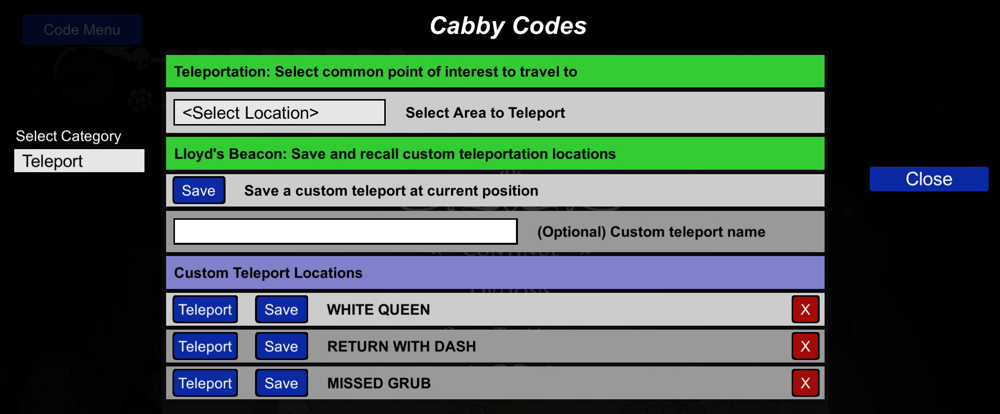

# CabbyCodes - Hollow Knight Cheat Menu Mod

A comprehensive cheat menu mod for Hollow Knight that provides extensive control over player stats, inventory, and game state through an intuitive in-game interface.

## 📋 Table of Contents
- [What is CabbyCodes?](#-what-is-cabbycodes)
- [Installation](#-installation)
  - [BepInEx Installation](#option-a-bepinex-installation-recommended-for-most-users)
  - [Lumafly/HKAPI Installation](#option-b-lumaflyh-api-installation)
- [Usage](#-usage)
- [Configuration](#️-configuration)
- [User Troubleshooting](#-user-troubleshooting)
- [Development](#️-development)
- [Contributing](#-contributing)
- [License & Third-Party Licenses](#-license)
- [Support](#-support)

## 🎮 What is CabbyCodes?

CabbyCodes is a powerful cheat menu mod that gives you complete control over your Hollow Knight experience. Whether you want to experiment with different builds, test game mechanics, or simply have fun with unlimited resources, CabbyCodes provides an easy-to-use interface accessible directly from the pause menu.

### Key Features

#### 🛡️ Player Modifications
- **Invulnerability**: Toggle player invincibility
- **Geo Management**: Set geo amount (0-9,999,999)
- **Infinite Soul**: Modify soul reserves and focus
- **Damage Control**: Toggle one-hit kills for enemies
- **Movement**: Infinite Air Jump

#### 📦 Inventory Management
- **Currency Items**: 
  - Wanderer's Journals (0-14)
  - Hallownest Seals (0-17)
  - King's Idols (0-8)
  - Arcane Eggs (0-4)
  - Rancid Eggs (0-80)
  - Pale Ore (0-6)
- **Keys**: All game keys and access items
- **Spells**: Control spell levels and upgrades
- **Nail Arts**: Manage nail art abilities
- **Charms**: Complete charm management system

#### 🎯 Game State Control
- **Hunter's Journal**: Complete enemy kill tracking
- **Grub Rescue**: Control grub collection status (46 total grubs)
- **Map Control**: Manage map exploration and pins
- **Achievements**: Achievement tracking and control
- **Flags**: Various game state flags and triggers

#### 🚀 Teleportation
- **Custom Locations**: Add and manage custom teleport points
- **Quick Travel**: Instant travel to any discovered location

#### 💾 Custom Save System
- **Unlimited Save Files**: Create unlimited custom save files at any point in the game
- **Location-Based Saves**: Save at specific points of interest and any location
- **Quick Load**: Instantly load any custom save file from the in-game menu
- **Save Management**: Organize and manage multiple save files with custom names
- **Real Saves**: These save files encoded like normal saves!  You can replace your slot save with one of these!

## 🖼️ Visual Showcase

See CabbyCodes in action! Here are screenshots of the various menu sections and features:


*The Cabby Codes button seamlessly integrates into the game's pause menu*


*The main cheat menu with organized categories and useful player cheats*


*Access anything inventory related*


*Custom teleport locations and quick travel system*


*Complete charm system with costs and effects management*


*Track and control all 46 grub rescue locations*


*Complete enemy kill tracking and journal management*


*Control boss encounters and game progression flags*


*Track and manage all game achievements*


*Create unlimited custom save files at any location*

## 🚀 Installation

CabbyCodes supports two mod loaders: **BepInEx** and **Lumafly** (Hollow Knight Modding API). Choose the installation method that matches your setup.

### Option A: BepInEx Installation (Recommended for most users)

#### Prerequisites
- Hollow Knight (Steam version)
- BepInEx 5.x or 6.x

#### Installation Steps
1. **Install BepInEx**:
   - Download BepInEx from [GitHub](https://github.com/BepInEx/BepInEx/releases)
     - For BepInEx 6: `BepInEx-Unity.Mono-win-x64-6.0.0-pre.2.zip`
     - For BepInEx 5: `BepInEx_win_x64_5.x.x.x.zip`
   - Extract to your Hollow Knight directory:
     - `C:\Program Files (x86)\Steam\steamapps\common\Hollow Knight`
   - Run the game once to generate BepInEx folders

2. **Install CabbyCodes**:
   - Download the latest release from the releases page
   - Extract the appropriate folder for your BepInEx version:
     - **BepInEx 5**: Use files from `CabbyCodes for BepInEx 5/`
     - **BepInEx 6**: Use files from `CabbyCodes for BepInEx 6/`
   - Copy both `CabbyCodes.dll` and `CabbyMenu.dll` to `Hollow Knight/BepInEx/plugins/`

3. **Verify Installation**:
   - Start the game and pause to access the cheat menu

---

### Option B: Lumafly/HKAPI Installation

#### Prerequisites
- Hollow Knight (Steam version)
- [Lumafly](https://github.com/TheMulhwormo/Lumafly) mod manager with Hollow Knight Modding API installed

#### Installation Steps
1. **Install Lumafly and HKAPI**:
   - Download and run [Lumafly](https://github.com/TheMulhwormo/Lumafly/releases)
   - Install any mod through Lumafly to set up the Modding API

2. **Install CabbyCodes**:
   - Download the latest release from the releases page
   - Extract the `CabbyCodes for Lumafly/` folder
   - Copy the **entire folder contents** to a new folder:
     - `Hollow Knight/hollow_knight_Data/Managed/Mods/CabbyCodes/`
   - The folder should contain:
     - `CabbyCodes.dll`
     - `CabbyMenu.dll`
     - `0Harmony.dll` (required - included in the release)

3. **Verify Installation**:
   - Start the game - the mod should appear in Lumafly's mod list
   - Pause the game to access the cheat menu

#### Important Notes for Lumafly Users
- The `0Harmony.dll` file is **required** and must be in the same folder as the mod DLLs
- HKAPI mods are installed differently than BepInEx - they go in `Managed/Mods/` not `BepInEx/plugins/`
- Each mod needs its own subfolder within the `Mods` directory
- Check `%APPDATA%\..\LocalLow\Team Cherry\Hollow Knight\ModLog.txt` for loading errors

## 🎯 Usage

### Accessing the Menu
1. **Pause the game** (ESC key)
2. **Click the "Cabby Codes" button** that appears
3. **Navigate categories** using the dropdown menu
4. **Modify values** by clicking on input fields

### Menu Categories
- **Player**: Health, geo, soul, abilities
- **Inventory**: All collectible items and currency
- **Charms**: Charm management and costs
- **Maps**: Map exploration and pins
- **Grubs**: Grub rescue tracking
- **Hunter**: Enemy kill tracking
- **Flags**: Game state flags
- **Achievements**: Achievement control
- **Debug**: Debug utilities and information

## ⚙️ Configuration

### Config File Location

The config file location depends on your mod loader:

**BepInEx:**
```
Hollow Knight/BepInEx/config/cabby.cabbycodes.cfg
```

**Lumafly/HKAPI:**
```
Hollow Knight/hollow_knight_Data/Managed/Mods/CabbyCodes/CabbyCodes.cfg
```

### Configuration System
The mod uses a configuration system for:
- **Teleport Locations**: Custom teleport points are automatically saved and loaded
- **Game State**: Various game modifications are persisted between sessions
- **Menu Settings**: Basic menu configuration options

### Teleport System
Custom teleport locations are automatically saved to the config file and will persist between game sessions. The system maintains:
- Location coordinates (X, Y)
- Scene names
- Display names for easy identification

## 🐛 User Troubleshooting

### Common Issues

**Menu doesn't appear (BepInEx):**
- Ensure both `CabbyCodes.dll` and `CabbyMenu.dll` are in the `BepInEx/plugins/` folder
- Check BepInEx console for error messages
- Verify BepInEx is properly installed

**Menu doesn't appear (Lumafly/HKAPI):**
- Ensure all three files (`CabbyCodes.dll`, `CabbyMenu.dll`, `0Harmony.dll`) are in `Managed/Mods/CabbyCodes/`
- The mod must be in its own subfolder - files directly in `Mods/` won't load
- Check `ModLog.txt` at `%APPDATA%\..\LocalLow\Team Cherry\Hollow Knight\ModLog.txt` for errors
- Verify the Modding API is installed (install any mod through Lumafly first)

**"Failed to initialize" error (Lumafly):**
- Make sure `0Harmony.dll` is present in the mod folder
- This file is included in the release package - don't remove it

**Values not updating:**
- Check that input values are within the required range

## 🛠️ Development

### Project Structure

This project uses a **multi-project solution** with three main components:

- **CabbyCodes**: Main mod plugin with game patches and logic
- **CabbyMenu**: Reusable UI library for creating mod menus
- **AssemblyTools**: Tools for analyzing Hollow Knight assemblies and references

```
HKCabbyCodes/
├── AssemblyTools/                # Tools for analyzing game assemblies
│   ├── Inspector/                # C# and PowerShell tools for analysis
│   └── Reference/                # Reference files (scenes, quick refs, docs)
│
├── CabbyCodes/                   # Main mod project
│   ├── Patches/                  # Game modification patches, organized by category
│   │   ├── Achievements/
│   │   ├── BasePatches/
│   │   ├── CharmPatch.cs
│   │   ├── Flags/
│   │   ├── GrubPatch.cs
│   │   ├── HunterPatch.cs
│   │   ├── InventoryPatch.cs
│   │   ├── Maps/
│   │   ├── Player/
│   │   ├── Settings/
│   │   ├── SpriteViewer/
│   │   └── Teleport/
│   ├── CheatState/               # Cheat state management system
│   ├── Flags/                    # Flag definitions and management
│   ├── SavedGames/               # Save game management
│   ├── Scenes/                   # Scene and area data
│   ├── lib/                      # Required game DLLs (not in version control)
│   ├── Constants.cs              # Game-specific constants
│   ├── CabbyCodesPlugin.cs       # Main plugin entry point
│   ├── GameStateProvider.cs      # Game state logic for menu visibility
│   └── ... (other core files)
│
├── CabbyMenu/                    # UI library project
│   ├── UI/
│   │   ├── CheatPanels/          # Modular cheat panel components
│   │   ├── Controls/             # UI controls (ToggleButton, InputField, etc.)
│   │   ├── DynamicPanels/        # Dynamic panel management
│   │   ├── Modders/              # UI modder utilities
│   │   ├── Popups/               # Popup dialogs
│   │   ├── CabbyMainMenu.cs      # Main menu system
│   │   ├── Fitter.cs             # UI layout utility
│   │   └── IPersistentPopup.cs   # Popup interface
│   ├── SyncedReferences/         # Data synchronization types/interfaces
│   ├── TextProcessors/           # Input text processing utilities
│   ├── Utilities/                # Shared utilities
│   ├── Constants.cs              # UI-specific constants
│   ├── IGameStateProvider.cs     # Interface for menu visibility logic
│   └── ... (other core files)
│
├── Makefile                      # Build and deployment scripts
├── global.json                   # .NET SDK version specification (9.0.301)
├── CabbyCodes.sln                # Solution file
└── README.md                     # Project documentation
```

**Key changes:**
- All utilities (e.g., `ValidationUtils`, `KeyCodeMap`) are now in `CabbyMenu/Utilities/`.
- UI controls and panels are organized under `CabbyMenu/UI/`.
- Patch files in `CabbyCodes/Patches/` are organized by gameplay category.
- Assembly analysis tools and references are in `AssemblyTools/`.

### 🔧 Development Requirements

#### .NET Framework and SDK
- **Target Framework**: .NET Framework 4.7.2 (required for compatibility with nuget dependencies and BepInEx version 6)
- **SDK Version**: .NET 9.0.301 (latest available, .NET 5.0+ is compatible)
- **Language Version**: C# 7.3 (latest supported by .NET Framework 4.7.2)

#### Required Tools
- **Visual Studio 2019/2022** or **Visual Studio Code** with C# extension
- **.NET 9.0 SDK** (for building with latest tooling)
- **Git** for version control

#### Configuration Files
- **global.json**: Specifies SDK version 9.0.301
- **CabbyCodes.csproj**: Targets `net472` with `LangVersion` set to `7.3`
- **CabbyMenu.csproj**: Targets `net472` with `LangVersion` set to `7.3`

### 📚 Required Library Files

Before building the project, you need to obtain the following DLL files and place them in the `CabbyCodes/lib/` directory:

#### Required Files:
- **Assembly-CSharp.dll** - Main game assembly (from Hollow Knight installation)
- **PlayMaker.dll** - PlayMaker FSM library (from Hollow Knight installation)

#### Optional Files:
- **UnityExplorer.STANDALONE.Mono.dll** - UnityExplorer in-game inspector (from UnityExplorer release) *(optional, see note below)*

#### File Structure:
```
CabbyCodes/
└── lib/
    ├── Assembly-CSharp.dll
    ├── PlayMaker.dll
    ├── UnityExplorer.STANDALONE.Mono.dll
```

**Note**: These files are excluded from version control due to licensing restrictions. You must obtain them manually before building and debugging the project.

#### UnityExplorer - In-Game Debug Tool

**What is UnityExplorer?**
UnityExplorer is a powerful in-game inspector and debugger that provides a graphical interface for examining game objects, components, and values at runtime. It's essential for development and debugging of Hollow Knight mods.

**What does it do?**
- **Object Inspector**: Browse and examine all game objects in the scene
- **Component Viewer**: View and modify component properties in real-time
- **Value Editor**: Change game values on-the-fly for testing
- **Method Invoker**: Call game methods directly for debugging
- **Scene Browser**: Navigate through different game scenes and objects

**How to Install UnityExplorer:**
1. **Download**: Get the latest release from [UnityExplorer GitHub](https://github.com/sinai-dev/UnityExplorer/releases)
2. **Extract**: Download the `UnityExplorer.STANDALONE.Mono.dll` file
3. **Install**: Place the DLL in your Hollow Knight `BepInEx/plugins/` folder
4. **Activate**: The mod automatically creates a UnityExplorer instance when the game starts

**Using UnityExplorer:**
- **Access**: Press `F7` in-game to open the UnityExplorer window
- **Debugging**: Use it to inspect game state, player data, and scene objects
- **Development**: Essential for understanding game structure and testing mod features

- If you want to use UnityExplorer, you can comment out the following line in `CabbyCodes/CabbyCodesPlugin.cs` (inside the `Start` method):
  ```csharp
  UnityExplorer.ExplorerStandalone.CreateInstance();
  ```
- This will allow you to build and run the mod with `UnityExplorer.STANDALONE.Mono.dll` in your `lib` folder.

#### UniverseLib - Reflection and Debugging Library

**What is UniverseLib?**
UniverseLib is a powerful reflection and debugging library that provides advanced tools for accessing private fields, methods, and game objects at runtime. It's commonly used in Hollow Knight modding for deep game state inspection and manipulation.

**What does it do?**
- **Reflection Utilities**: Access private fields and methods
- **Object Inspection**: Deep examination of game objects and components
- **Memory Manipulation**: Advanced memory reading and writing capabilities
- **Runtime Type Creation**: Create and modify types at runtime
- **Debugging Tools**: Enhanced debugging and development features

**How to Install UniverseLib:**
1. **Download**: Get the latest release from [UniverseLib releases](https://github.com/sinai-dev/UniverseLib/releases)
2. **Extract**: Download the `UniverseLib.Mono.dll` file
3. **Install**: Place the DLL in your Hollow Knight `BepInEx/plugins/` folder
4. **Usage**: Access through UnityExplorer or other modding tools

**Using UniverseLib:**
- **Integration**: Works with UnityExplorer for enhanced debugging
- **Development**: Essential for advanced mod development and testing
- **Reflection**: Access game internals that aren't normally accessible

### 🛠️ Building from Source

#### Using Make (Recommended)
```bash
# Build the entire solution
make build

# Build individual projects
make build-cabbycodes
make build-cabbymenu

# Clean build artifacts
make clean

# Deploy to game directory
make deploy
```

#### Using .NET CLI
```bash
# Restore dependencies
dotnet restore

# Build the solution
dotnet build --configuration Release

# Build individual projects
dotnet build CabbyCodes/CabbyCodes.csproj --configuration Release
dotnet build CabbyMenu/CabbyMenu.csproj --configuration Release
```

### 🔗 Project Dependencies
- **CabbyCodes** depends on **CabbyMenu** for UI functionality
- **CabbyMenu** is a standalone library that can be used by other mods
- Both projects target .NET Framework 4.7.2

### 📦 Build Output
- **CabbyCodes.dll**: Main mod plugin (contains game patches)
- **CabbyMenu.dll**: UI library (required by CabbyCodes)

### 🔧 Key Components

#### CabbyCodes Project
- **CabbyCodesPlugin**: Main plugin entry point
- **Patches/**: Game modification patches organized by category
- **Constants.cs**: Game-specific constants (health limits, currency limits, etc.)

#### CabbyMenu Project
- **UI/**: Complete UI system with panels, controls, and factories
- **SyncedReferences/**: Data synchronization interfaces
- **Constants.cs**: UI constants (panel sizes, character limits, etc.)

## 🐛 Developer Troubleshooting

### Common Issues

**Build errors:**
- Ensure .NET 6.0 SDK is installed
- Run `dotnet restore` to restore dependencies
- Check that both projects are included in the solution

**Deployment issues:**
- Use `make deploy` to automatically copy both DLLs
- Verify the Hollow Knight path in the Makefile
- Check file permissions in the plugins directory

### Debug Information
Check the BepInEx console for detailed information about:
- Menu interactions
- Value changes
- Error conditions
- Configuration loading/saving

## 🤝 Contributing

**Contributions are welcome!** We encourage community involvement in improving CabbyCodes. Whether you're fixing bugs, adding new features, or improving documentation, your contributions help make this mod better for everyone.

### How to Contribute

#### Submitting Changes
1. **Fork the repository** to your GitHub account
2. **Create a feature branch**: `git checkout -b feature/new-feature`
3. **Make your changes** and add tests if applicable
4. **Commit your changes**: `git commit -am 'Add new feature'`
5. **Push to the branch**: `git push origin feature/new-feature`
6. **Submit a pull request** from your fork to the main repository

#### Before Contributing
- **Check existing issues** to see if your idea has already been discussed
- **Use the Issues tab** to report bugs or request new features
- **Use the Discussions tab** to discuss potential changes or ask questions

### Project Organization
- **Game Logic**: Add to CabbyCodes project
- **UI Components**: Add to CabbyMenu project
- **Shared Types**: Place in appropriate project based on usage
- **Constants**: UI constants in CabbyMenu, game constants in CabbyCodes

## 📄 License

This project is licensed under the MIT License - see the [LICENSE](LICENSE) file for details.

### Third-Party Licenses

**HarmonyX** - The Lumafly version of CabbyCodes includes `0Harmony.dll` from [HarmonyX](https://github.com/BepInEx/HarmonyX), which is licensed under the MIT License:

```
MIT License

Copyright (c) 2020 BepInEx Team

Permission is hereby granted, free of charge, to any person obtaining a copy
of this software and associated documentation files (the "Software"), to deal
in the Software without restriction, including without limitation the rights
to use, copy, modify, merge, publish, distribute, sublicense, and/or sell
copies of the Software, and to permit persons to whom the Software is
furnished to do so, subject to the following conditions:

The above copyright notice and this permission notice shall be included in all
copies or substantial portions of the Software.

THE SOFTWARE IS PROVIDED "AS IS", WITHOUT WARRANTY OF ANY KIND, EXPRESS OR
IMPLIED, INCLUDING BUT NOT LIMITED TO THE WARRANTIES OF MERCHANTABILITY,
FITNESS FOR A PARTICULAR PURPOSE AND NONINFRINGEMENT. IN NO EVENT SHALL THE
AUTHORS OR COPYRIGHT HOLDERS BE LIABLE FOR ANY CLAIM, DAMAGES OR OTHER
LIABILITY, WHETHER IN AN ACTION OF CONTRACT, TORT OR OTHERWISE, ARISING FROM,
OUT OF OR IN CONNECTION WITH THE SOFTWARE OR THE USE OR OTHER DEALINGS IN THE
SOFTWARE.
```

## 🙏 Acknowledgments

- **Team Cherry** for creating Hollow Knight
- **BepInEx Team** for the modding framework and [HarmonyX](https://github.com/BepInEx/HarmonyX)
- **Hollow Knight Modding Community** for the [Modding API](https://github.com/hk-modding/api)
- **Unity Technologies** for the game engine

## 📞 Support

### Getting Help
- **GitHub Issues**: Report bugs and request features

### Reporting Bugs
When reporting bugs, please include:
- Game version and mod version
- Steps to reproduce the issue
- BepInEx console output
- Any error messages
- System specifications

---

**Note**: This mod is for educational and entertainment purposes. Enjoy.